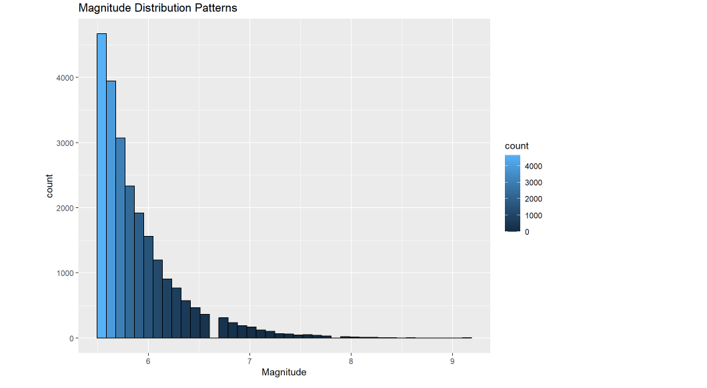
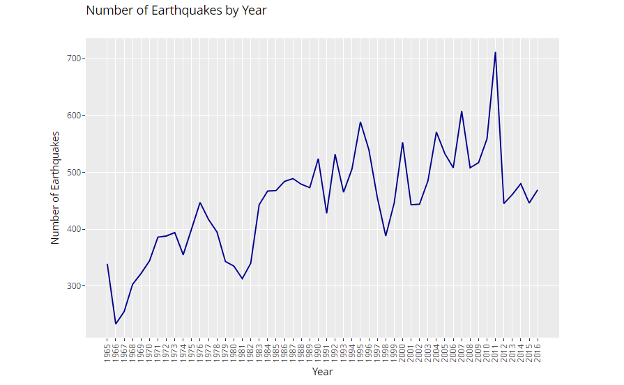
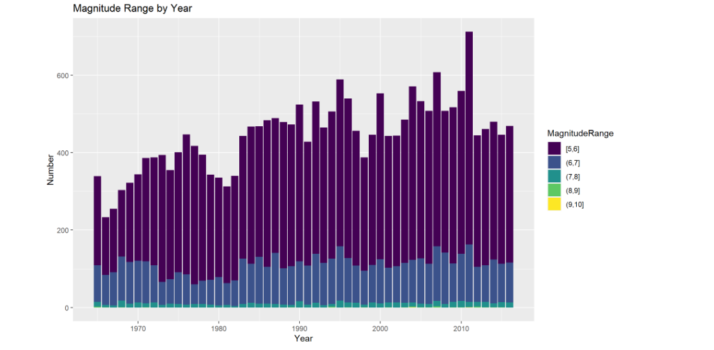
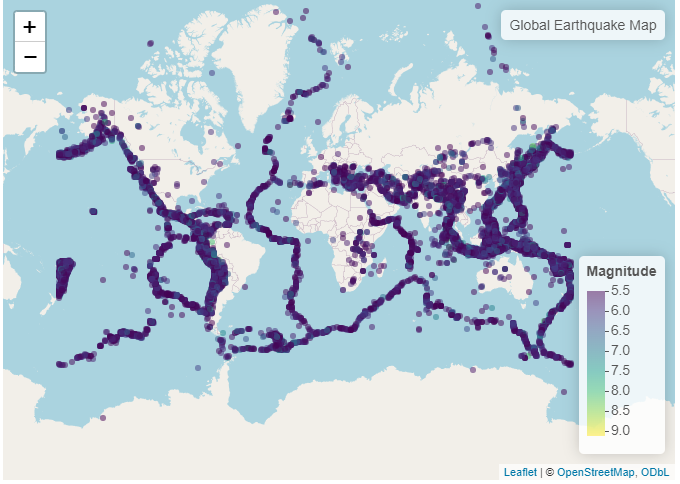
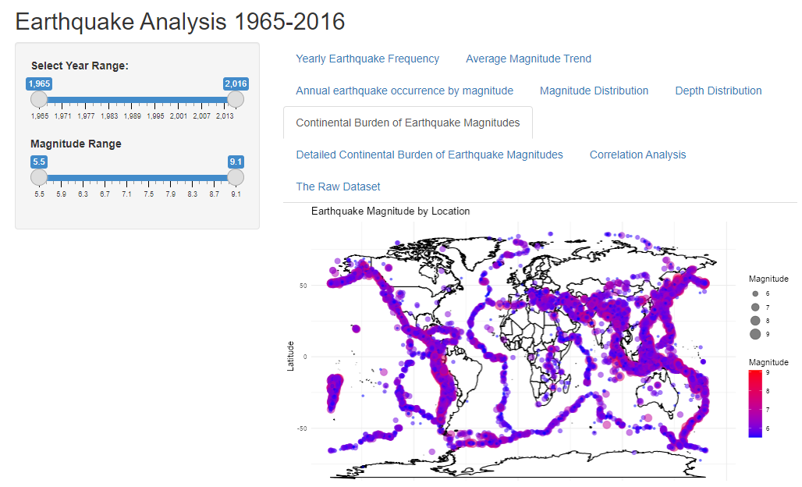

# **Insights into Earthquake Patterns from 1965 to 2016**

**Authors:** Penina|Sandra|Joash

## **Overview**

This project aims to analyze and visualize the impact of earthquakes across the globe. Utilizing data from the  [Kaggle](https://www.kaggle.com/datasets/usgs/earthquake-database?resource=download) which includes records of date, time, location, type, and magnitude for historical earthquakes, we will:

* Create interactive time series visualizations to provide a quick overview of earthquake activity and trends.
* Perform spatial cluster analysis to identify areas with high earthquake frequency and assess the burden faced by individual countries and regions.
* Investigate the correlation between earthquake magnitude and damage caused to gain insights into potential risks associated with future events.
* Evaluate the impact of earthquakes on different continents to understand the global distribution of earthquake burden.

**Technology Stack:**

* **Data analysis and manipulation:** R programming langu
* **Interactive visualization:** Shiny web framework

The project will ultimately be presented as a Shiny app, allowing users to explore the data and visualizations in an interactive and user-friendly manner.

####  **Distribution of earthquake sizes**
Most recorded earthquakes had magnitudes of 6 or lower. However, there are instances of more intense seismic activity, with values exceeding 6.5. This may be attributed to significant earthquakes, including those in Alaska in 1965-1966, the Rat Islands, the Indian Ocean in 2004, and Chile in 2010.

### **2.0 Time Series Analysis**

In recent years(2000-2016), there has been a notable rise in the frequency of earthquakes. This trend may be linked to the increased availability of seismic sensors capable of recording more seismic activity, coupled with advancements in communication technology. Contrary to earlier times when technological limitations posed challenges, the contemporary landscape benefits from improved data collection methods. Despite the growth in earthquake occurrences, the magnitudes have not seen significant increase
This can be attributed to advancements in technology and heightened preparedness among the public.

#### **Annual earthquake occurrence by magnitude**

While the number of earthquakes increased over the years with different magnitudes, the number of large magnitude earthquakes (>5.6) has remained relatively constant throughout time. It is observed that extreme magnitude have been declining with extreme occurring last three decades and early 2004 and 2014.

Certain years or periods may exhibit spikes in earthquake activity across multiple magnitude ranges, indicating periods of intense seismic activity.Long-term cycles in earthquake activity may become apparent, highlighting periods of increased or decreased seismicity over longer time scales.

### **Spatial Analysis** 
Earthquakes are predominantly concentrated in coastal regions, but it's noteworthy that a substantial number also occur inland, such as in East Africa's Rift Valley and various areas in Asia. This distribution can be attributed to the fact that earthquakes primarily manifest along the boundaries of tectonic plates, massive rock slabs constantly in motion on the Earth's surface.

These seismic activities result from different plate boundary interactions:

Convergent margins (subduction zones): Occur when one plate descends beneath another, often leading to large and deep earthquakes. Such zones extend beyond coasts, as evident in the Himalayas.
Divergent margins (rift zones): Manifesting when plates separate, as seen in the recent earthquakes in the East African Rift Valley. These occurrences are not confined to coastal areas.
Transform faults: Take place when plates slide horizontally past each other, exemplified by the San Andreas Fault in California. These events can transpire both inland and near coasts.
The distinction between coastal and inland seismic activity lies in the misconception that all coastal regions are earthquake-prone due to subduction zones. Conversely, significant earthquakes can transpire far inland along other plate boundaries, contingent upon the specific location and prevailing tectonic activity.

In the context of Africa, the continent straddles multiple tectonic plates, including the relatively stable African Plate. However, seismic events do transpire, particularly along the Great Rift Valley and the Red Sea Rift. The perception of fewer earthquakes in Africa may be influenced by factors such as population density and media coverage. Densely populated coastal areas may experience and report earthquakes more frequently, while global news may prioritize covering seismic events impacting larger populations or causing substantial damage.

### **The Shiny App**

A more detailed and interactive analysis can be found in the embedded shiny app below. Users can filter the data and visualizations using the slider for year and Magnitude on the left side navigation panel.

### **Conclusion**

From the data, time series analysis indicated fluctuations in seismic activity showcasing periods of relative seismic calm with clusters of heightened activity. The distribution of the earthquake magnitude in the years seemed to be more concentrated in the magnitude range of 5.5. 
The geographical distribution of earthquakes was predominant in the coastal areas which may correspond with tectonic plate boundaries with significant geological activity. Insights gained from the correlation analysis revealed the depth of an earthquake doesn’t determine its strength or magnitude.
Overall, the analysis of significant earthquakes from 1965 to 2016 utilizing various data visualization techniques provides valuable insights into temporal and spatial patterns, helping to enhance our understanding of seismic activity and inform strategies to mitigate risks. 

#### **Challenges**

* **Unpredictable Nature of Earthquakes:** Earthquakes are inherently unpredictable, striking with little warning, making forecasting a significant challenge.
* **Data Limitations:** The absence of real-time data on pre-earthquake tectonic plate movements in the dataset significantly hinders our ability to anticipate earthquakes.
* **Incomplete Observations:** The data lacks crucial variables such as the destruction statistics in terms of people and property necessary for comprehensive analysis, potentially affecting the validity of our findings.
* **Missing Data Points:** The presence of missing values (null values) within the dataset limits the scope of our analysis and the strength of our conclusions.

#### **Recommendations**

1. Leverage advanced technologies like machine learning and AI to analyze real-time earthquake data and create predictive models.
2. Collaborate with experts across various fields to guarantee comprehensive data collection during the initial stages.

#### **For More Information**
See full analysis in <a href ="app.R">shiny App</a> or the Markdown report <a href ="earthquake_analysis_report.Rmd of Telco Churn Rate.pdf">here</a>

# Repository Structure

├── data 
├── graphs 
├── README.md 
├── earthquake_analysis_report.Rmd 
└── app.R

